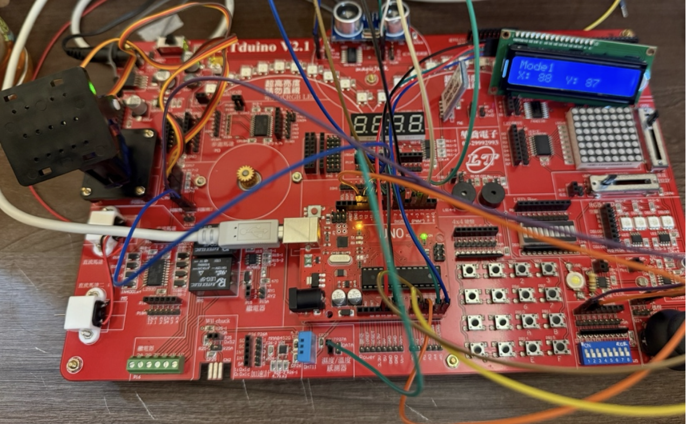
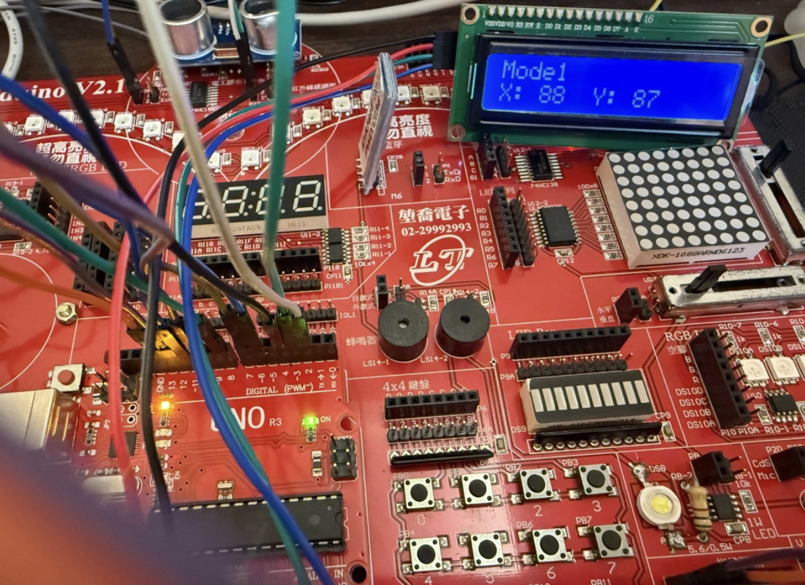
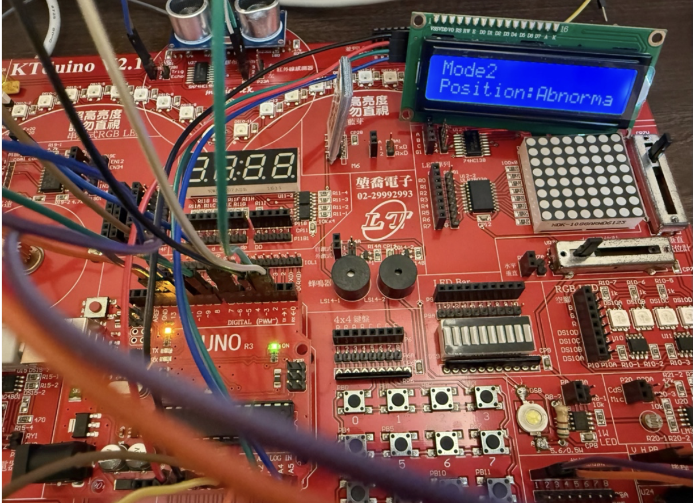
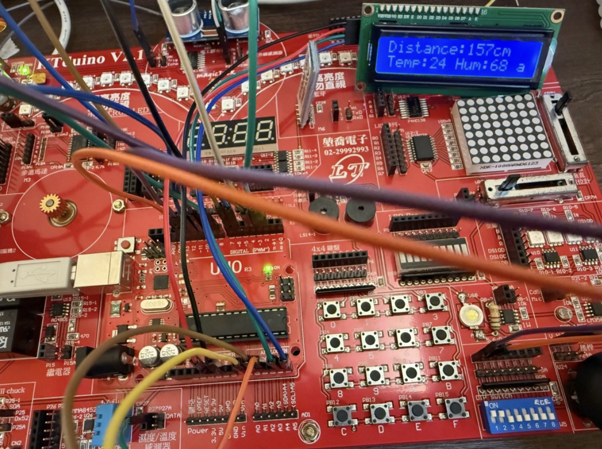

# 單晶片綜合感測器系統 🤖

單晶片系統實作課程作業，使用 KTduino 開發板整合伺服馬達、搖桿、紅外線感測器、超音波感測器、溫濕度感測器與 LCD，透過指撥開關切換三種運行模式。

🎬 **[Demo 影片](https://drive.google.com/file/d/1X70Vn5HVDQmVxKwi8BKXKkLk0FzAPMeV/view?usp=sharing)**

---

## 硬體實作照片

### 完整系統


### 模式一：搖桿控制伺服馬達


### 模式二：紅外線感測器


### 模式三：超音波 / 溫濕度感測器


---

## 功能說明

本系統透過指撥開關（DIP Switch）切換三種模式：

### 模式一：搖桿控制伺服馬達
- 讀取搖桿 X、Y 軸類比訊號（A1、A2）
- 將數值對應到 0～180° 控制兩個伺服馬達轉動角度
- LCD 即時顯示目前角度，例如：`X: 88  Y: 87`

### 模式二：紅外線路徑感測
- 三顆紅外線感測器（左 D2、中 D3、右 D4）偵測黑線位置
- LCD 顯示目前位置狀態：
  - `Normal`：位置正常
  - `S-Right` / `S-Left`：微偏右 / 微偏左
  - `Right` / `Left`：偏右 / 偏左
  - `Abnormal`：不正常

### 模式三：超音波 + 溫濕度感測
- 超音波感測器（TRIG D7、ECHO D6）量測距離
- DHT11 感測器（D8）量測溫度與濕度
- LCD 顯示距離、溫度、濕度，例如：`Distance:30cm` / `Temp:24 Hum:68`

---

## 腳位配置

| 功能 | 腳位 |
|------|------|
| 指撥開關 S0 | D12 |
| 指撥開關 S1 | D13 |
| 伺服馬達 1 | D10 |
| 伺服馬達 2 | D11 |
| 搖桿 X 軸 | A1 |
| 搖桿 Y 軸 | A2 |
| 紅外線感測器 左 | D2 |
| 紅外線感測器 中 | D3 |
| 紅外線感測器 右 | D4 |
| 超音波 TRIG | D7 |
| 超音波 ECHO | D6 |
| DHT11 溫濕度 | D8 |
| LCD（I2C）| SDA/SCL |

---

## 使用函式庫

```cpp
#include <Wire.h>
#include <LiquidCrystal_I2C.h>
#include <Servo.h>
#include <DHT.h>
```

---

## 如何使用

1. 開啟 Arduino IDE
2. 安裝所需函式庫（LiquidCrystal_I2C、DHT sensor library）
3. 開啟 `Arduino_HW4_B2209131.ino`
4. 選擇正確的開發板與 COM 埠
5. 上傳程式碼
6. 透過指撥開關切換模式

---

## 檔案結構

```
arduino-hw4/
├── Arduino_HW4_B2209131.ino   # 主程式
├── docs/
│   ├── full-system.jpg        # 完整系統照片
│   ├── mode1-servo.jpg        # 模式一照片
│   ├── mode2-ir.jpg           # 模式二照片
│   └── mode3-sensor.jpg       # 模式三照片
└── README.md
```

---

## 學習成果

- 整合多個感測器模組於單一系統，處理腳位衝突與初始化順序
- 以指撥開關實作狀態切換機制
- 理解伺服馬達大電流需求對 I2C 傳輸的影響，學習外接電源與共地設置
- 實作超音波距離量測（pulseIn）與 DHT11 溫濕度感測
- 使用 AI 工具輔助程式開發與除錯
